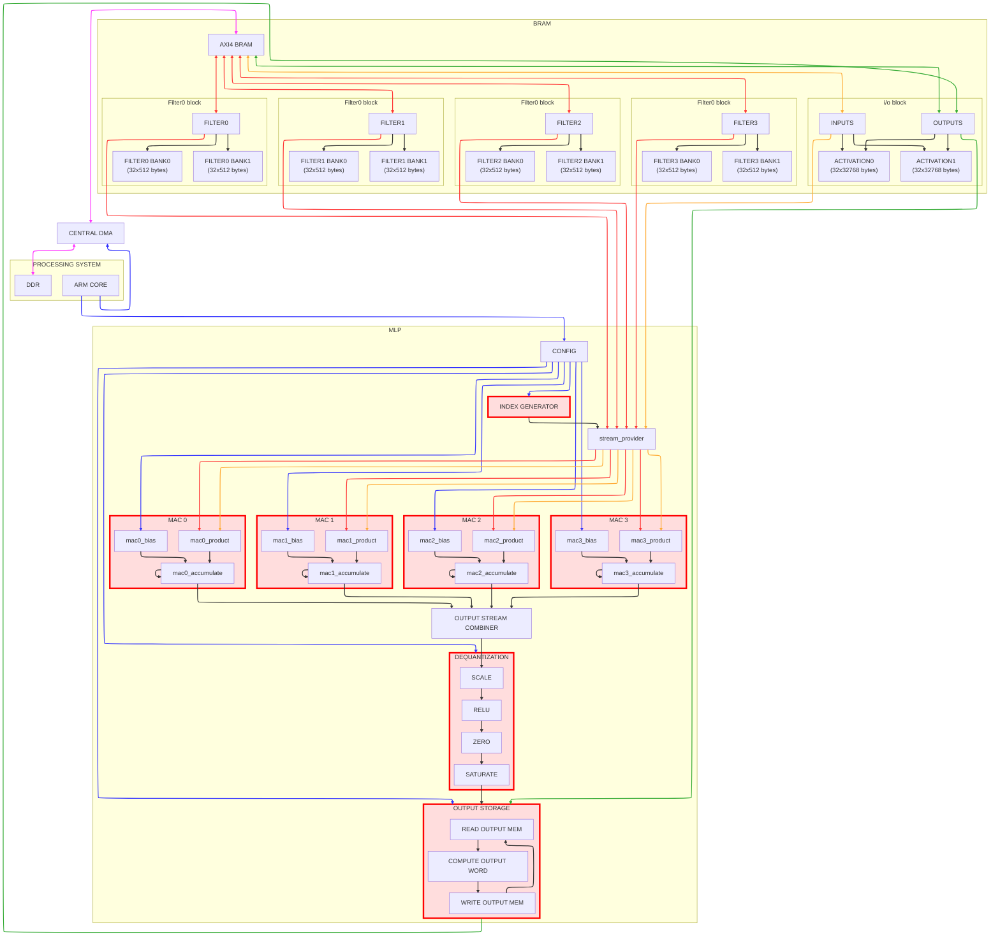

Mermaid diagram (https://www.mermaidchart.com, https://mermaid.js.org)

```mermaid
---
config:
  layout: elk
  look: classic
---
flowchart TB
    subgraph bram["BRAM"]
        subgraph s_a["i/o block"]
            i["INPUTS"]
            o["OUTPUTS"]
            a0["ACTIVATION0<br>(32x32768 bytes)"]
            a1["ACTIVATION1<br>(32x32768 bytes)"]
        end
        subgraph s_f0["Filter0 block"]
            f0["FILTER0"]
            f0_0["FILTER0 BANK0<br>(32x512 bytes)"]
            f0_1["FILTER0 BANK1<br>(32x512 bytes)"]
        end
        subgraph s_f1["Filter0 block"]
            f1["FILTER1"]
            f1_0["FILTER1 BANK0<br>(32x512 bytes)"]
            f1_1["FILTER1 BANK1<br>(32x512 bytes)"]
        end
        subgraph s_f2["Filter0 block"]
            f2["FILTER2"]
            f2_0["FILTER2 BANK0<br>(32x512 bytes)"]
            f2_1["FILTER2 BANK1<br>(32x512 bytes)"]
        end
        subgraph s_f3["Filter0 block"]
            f3["FILTER3"]
            f3_0["FILTER3 BANK0<br>(32x512 bytes)"]
            f3_1["FILTER3 BANK1<br>(32x512 bytes)"]
        end
        axi_bram["AXI4 BRAM"]
    end

    subgraph mlp["MLP"]
        axi_config["CONFIG"]
        igen["INDEX GENERATOR"]
        stream_provider
        subgraph mac0["MAC 0"]
            mac0_bias
            mac0_product
            mac0_accumulate
        end
        subgraph mac1["MAC 1"]
            mac1_bias
            mac1_product
            mac1_accumulate
        end
        subgraph mac2["MAC 2"]
            mac2_bias
            mac2_product
            mac2_accumulate
        end
        subgraph mac3["MAC 3"]
            mac3_bias
            mac3_product
            mac3_accumulate
        end
        combiner["OUTPUT STREAM COMBINER"]
        subgraph dequantization["DEQUANTIZATION"]
            scale["SCALE"]
            relu["RELU"]
            zero["ZERO"]
            saturate["SATURATE"]
        end
        subgraph ostorage["OUTPUT STORAGE"]
            read["READ OUTPUT MEM"]
             --> delay["COMPUTE OUTPUT WORD"]
             --> write["WRITE OUTPUT MEM"]
             --> read
        end
    end

    subgraph ps["PROCESSING SYSTEM"]
        DDR
        arm["ARM CORE"]
    end

    cdma["CENTRAL DMA"]
    cdma <--> axi_bram & DDR
    cdma ~~~ arm
    linkStyle 3,4 stroke:#f3f

    arm --> cdma & axi_config
    axi_config --> igen & mac0_bias & mac1_bias & mac2_bias & mac3_bias & dequantization & ostorage
    linkStyle 6,7,8,9,10,11,12,13,14 stroke:#33f

    f0 --> f0_0 & f0_1 & stream_provider
    f1 --> f1_0 & f1_1 & stream_provider
    f2 --> f2_0 & f2_1 & stream_provider
    f3 --> f3_0 & f3_1 & stream_provider
    i --> a0 & a1 & stream_provider
    o --> a0 & a1 & ostorage
    axi_bram <--> f0 & f1 & f2 & f3 & i & o
    stream_provider --> mac0_product & mac1_product & mac2_product & mac3_product & mac0_product & mac1_product & mac2_product & mac3_product
    linkStyle 17,20,23,26,33,34,35,36,39,40,41,42 stroke:#f33
    linkStyle 29,37,43,44,45,46 stroke:#fa3

    igen --> stream_provider
    mac0_product --> mac0_accumulate
    mac1_product --> mac1_accumulate
    mac2_product --> mac2_accumulate
    mac3_product --> mac3_accumulate
    mac0_bias --> mac0_accumulate
    mac1_bias --> mac1_accumulate
    mac2_bias --> mac2_accumulate
    mac3_bias --> mac3_accumulate

    mac0_accumulate --> mac0_accumulate & combiner
    mac1_accumulate --> mac1_accumulate & combiner
    mac2_accumulate --> mac2_accumulate & combiner
    mac3_accumulate --> mac3_accumulate & combiner

    combiner --> scale --> relu --> zero --> saturate
    saturate --> ostorage
    ostorage --> o

    linkStyle 32,38,69 stroke:#3a3

    linkStyle default stroke-width:2

    classDef student fill:#FDD,stroke:red,stroke-width:4
    class igen,mac0,mac1,mac2,mac3,dequantization,ostorage student

```